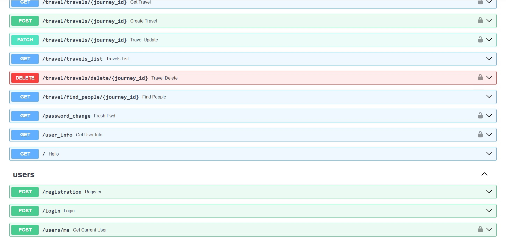

# Лабораторная работа №1

Научиться реализовывать полноценное серверное приложение с помощью фреймворка FastAPI с применением дополнительных средств и библиотек.
Задача - создать веб-приложение, которое позволит пользователям обмениваться книгами между собой. Это приложение должно облегчать процесс обмена книгами, позволяя пользователям находить книги, которые им интересны, и находить новых пользователей для обмена книгами. Функционал веб-приложения должен включать следующее:
Создание профилей: Возможность пользователям создавать профили, указывать информацию о себе, своих навыках, опыте работы и предпочтениях по проектам.
Добавление книг в библиотеку: Пользователи могут добавлять книги, которыми они готовы поделиться, в свою виртуальную библиотеку на платформе.
Поиск и запросы на обмен: Функционал поиска книг в библиотеке других пользователей. Возможность отправлять запросы на обмен книгами другим пользователям.
Управление запросами и обменами: Возможность просмотра и управления запросами на обмен. Возможность подтверждения или отклонения запросов на обмен.

## Ход выполнения работы

### main.py:

    import uvicorn
    from fastapi import FastAPI, HTTPException
    from db import init_db
    from endpoints.travel_endpoints import travel_router
    from endpoints.user_endpoints import user_router
    from worker import product_parse
    
    app = FastAPI()
    app.include_router(travel_router, prefix="/travel")
    app.include_router(user_router)
    
    @app.on_event("startup")
    def on_startup():
        init_db()
    
    @app.get('/')
    def hello():
        return 'hello'
 
    if __name__ == '__main__':
        uvicorn.run('main:app', host="localhost", port=8080, reload=True)

### auth.py:
    import datetime
    
    from fastapi import Security, HTTPException
    from fastapi.security import HTTPBearer, HTTPAuthorizationCredentials
    from passlib.context import CryptContext
    import jwt
    from starlette import status
    from dotenv import load_dotenv
    
    from repos.user_repos import find_user
    
    import os
    
    load_dotenv()
    
    secret_key = os.getenv("SECRET_KEY")
    #secret_key = 'secret_key'
    
    class AuthHandler:
        security = HTTPBearer()
        pwd_context = CryptContext(schemes=['bcrypt'])
        secret = secret_key
    
        def get_password_hash(self, password):
            return self.pwd_context.hash(password)
    
        def verify_password(self, pwd, hashed_pwd):
            return self.pwd_context.verify(pwd, hashed_pwd)
    
        def encode_token(self, user_id):
            payload = {
                'exp': datetime.datetime.utcnow() + datetime.timedelta(hours=8),
                'iat': datetime.datetime.utcnow(),
                'sub': user_id
            }
            return jwt.encode(payload, self.secret, algorithm='HS256')
    
        def decode_token(self, token):
            try:
                payload = jwt.decode(token, self.secret, algorithms=['HS256'])
                return payload['sub']
            except jwt.ExpiredSignatureError:
                raise HTTPException(status_code=401, detail='Expired signature')
            except jwt.InvalidTokenError:
                raise HTTPException(status_code=401, detail='Invalid token')
    
        def auth_wrapper(self, auth: HTTPAuthorizationCredentials = Security(security)):
            return self.decode_token(auth.credentials)
    
        def get_current_user(self, auth: HTTPAuthorizationCredentials = Security(security)):
            credentials_exception = HTTPException(
                status_code=status.HTTP_401_UNAUTHORIZED,
                detail='Could not validate credentials'
            )
            username = self.decode_token(auth.credentials)
            if username is None:
                raise credentials_exception
            user = find_user(username)
            if username is None:
                raise credentials_exception
            return user
### travel_endpoints.py
    from fastapi import APIRouter, HTTPException, Depends
    from typing import List
    
    from sqlmodel import Session, select
    
    from db import db_session as session, get_session
    from endpoints.user_endpoints import auth_handler
    
    from models.travel_models import *
    
    travel_router = APIRouter()
    
    @travel_router.get("/places/{place_id}")
    def get_place(place_id: int):
        place = session.get(Place, place_id)
        if not place:
            raise HTTPException(status_code=404, detail="Place did not found")
        return place
    
    @travel_router.post("/places")
    def create_place(def_place: Place_Default):
        place = Place.model_validate(def_place)
        session.add(place)
        session.commit()
        session.refresh(place)
        return {"status": 200, "data": place}
    
    @travel_router.get("/places_list")
    def places_list(session=Depends(get_session)) -> List[Place]:
        return session.exec(select(Place)).all()
    
    @travel_router.delete("/places/delete/{place_id}")
    def place_delete(place_id: int, session=Depends(get_session)):
        place = session.get(Place, place_id)
        if not place:
            raise HTTPException(status_code=404, detail="Place did not found")
        session.delete(place)
        session.commit()
        return {"ok": True}
    
    @travel_router.patch("/places/{place_id}")
    def place_update(place_id: int, place: Place_Default, session=Depends(get_session)) -> Place_Default:
        db_place = session.get(Place, place_id)
        if not db_place:
            raise HTTPException(status_code=404, detail="Place did not found")
        place_data = place.model_dump(exclude_unset=True)
        for key, value in place_data.items():
            setattr(db_place, key, value)
        session.add(db_place)
        session.commit()
        session.refresh(db_place)
        return db_place
    
    @travel_router.get("/routes/{route_id}")
    def get_route(route_id: int):
        route = session.get(Route, route_id)
        if not route:
            raise HTTPException(status_code=404, detail="Route did not found")
        return route
    
    @travel_router.post("/routes")
    def create_route(def_route: Route_Default):
        route = Route.model_validate(def_route)
        session.add(route)
        session.commit()
        session.refresh(route)
        return {"status": 200, "data": route}
    
    @travel_router.get("/routes_list")
    def routes_list(session=Depends(get_session)) -> List[Route]:
        return session.exec(select(Route)).all()
    
    @travel_router.delete("/routes/delete/{route_id}")
    def route_delete(route_id: int, session=Depends(get_session)):
        route = session.get(Route, route_id)
        if not route:
            raise HTTPException(status_code=404, detail="Route did not found")
        session.delete(route)
        session.commit()
        return {"ok": True}
    
    @travel_router.patch("/routes/{route_id}")
    def route_update(route_id: int, route: Route_Default, session=Depends(get_session)) -> Route_Default:
        db_route = session.get(Route, route_id)
        if not db_route:
            raise HTTPException(status_code=404, detail="Route did not found")
        route_data = route.model_dump(exclude_unset=True)
        for key, value in route_data.items():
            setattr(db_route, key, value)
        session.add(db_route)
        session.commit()
        session.refresh(db_route)
        return db_route
    
    
    @travel_router.get("/orders/{route_id}/{place_id}")
    def get_order(route_id: int, place_id: int):
        order = session.query(Order).filter(Order.route_id == route_id, Order.place_id == place_id).first()
        if not order:
            raise HTTPException(status_code=404, detail="Order did not found")
        return order
    
    @travel_router.post("/orders")
    def create_order(def_order: Order):
        order = Order.model_validate(def_order)
        route = session.get(Route, order.route_id)
        place = session.get(Place, order.place_id)
        if (not route) or (not place):
            raise HTTPException(status_code=404, detail="Impossible id")
        session.add(order)
        session.commit()
        session.refresh(order)
        return {"status": 200, "data": order}
    
    @travel_router.get("/orders_list")
    def orders_list(session=Depends(get_session)) -> List[Order]:
        return session.exec(select(Order)).all()
    
    @travel_router.delete("/orders/delete/{route_id}/{place_id}")
    def order_delete(route_id: int, place_id: int, session=Depends(get_session)):
        order = session.get(Order, (route_id,place_id))
        if not order:
            raise HTTPException(status_code=404, detail="Order did not found")
        session.delete(order)
        session.commit()
        return {"ok": True}
    
    @travel_router.patch("/orders/{route_id}/{place_id}")
    def order_update(route_id: int, place_id: int, order: Order_Default, session=Depends(get_session)) -> Order:
        db_order = session.get(Order, (route_id,place_id))
        if not db_order:
            raise HTTPException(status_code=404, detail="Order did not found")
        order_data = order.model_dump(exclude_unset=True)
        for key, value in order_data.items():
            setattr(db_order, key, value)
        route = session.get(Route, route_id)
        place = session.get(Place, place_id)
        if (not route) or (not place):
            raise HTTPException(status_code=404, detail="Impossible id")
        session.add(db_order)
        session.commit()
        session.refresh(db_order)
        return db_order
    
    @travel_router.get("/journeys/{journey_id}")
    def get_journey(journey_id: int):
        journey = session.get(Journey, journey_id)
        if not journey:
            raise HTTPException(status_code=404, detail="Journey did not found")
        return journey
    
    @travel_router.post("/journeys")
    def create_journey(def_journey: Journey_Default, user=Depends(auth_handler.get_current_user)):
        journey = Journey(name=def_journey.name, descryption=def_journey.descryption, user_id=user.id)
        session.add(journey)
        session.commit()
        session.refresh(journey)
        return {"status": 200, "data": journey}
    
    @travel_router.get("/journeys_list")
    def journey_list(session=Depends(get_session)) -> List[Journey]:
        return session.exec(select(Journey)).all()
    
    @travel_router.delete("/journeys/delete/{journey_id}")
    def journey_delete(journey_id: int, session=Depends(get_session), user=Depends(auth_handler.get_current_user)):
        journey = session.get(Journey, journey_id)
        if not journey:
            raise HTTPException(status_code=404, detail="Journey did not found")
        if journey.user_id != user.id:
            raise HTTPException(status_code=404, detail="You can't delete this journey")
        session.delete(journey)
        session.commit()
        return {"ok": True}
    
    @travel_router.patch("/journeys/{journey_id}")
    def journey_update(journey_id: int, journey: Journey_Redact, session=Depends(get_session), user=Depends(auth_handler.get_current_user)) -> Journey_Redact:
        db_journey = session.get(Journey, journey_id)
        if not db_journey:
            raise HTTPException(status_code=404, detail="Journey did not found")
        if db_journey.user_id != user.id:
            raise HTTPException(status_code=404, detail="You can't delete this journey")
        journey_data = journey.model_dump(exclude_unset=True)
        for key, value in journey_data.items():
            setattr(db_journey, key, value)
        route = session.get(Route, db_journey.route_id)
        if not route:
            raise HTTPException(status_code=404, detail="Impossible id")
        session.add(db_journey)
        session.commit()
        session.refresh(db_journey)
        return db_journey
    
    
    
    @travel_router.get("/travels/{journey_id}")
    def get_travel(journey_id: int, user=Depends(auth_handler.get_current_user)):
        travel = session.query(Travel).filter(Travel.journey_id == journey_id, Travel.user_id == user.id).first()
        if not travel:
            raise HTTPException(status_code=404, detail="Travel did not found")
        return travel
    
    @travel_router.post("/travels/{journey_id}")
    def create_travel(journey_id: int, def_travel: Travel_Default, user=Depends(auth_handler.get_current_user)):
    
        journey = session.get(Journey, journey_id)
        if not journey:
            raise HTTPException(status_code=404, detail="Impossible id")
        travel = Travel(journey_id = journey_id, descryption=def_travel.descryption, user_id=user.id)
        session.add(travel)
        session.commit()
        session.refresh(travel)
        return {"status": 200, "data": travel}
    
    @travel_router.get("/travels_list")
    def travels_list(session=Depends(get_session)) -> List[Travel]:
        return session.exec(select(Travel)).all()
    
    @travel_router.delete("/travels/delete/{journey_id}")
    def travel_delete(journey_id: int, session=Depends(get_session), user=Depends(auth_handler.get_current_user)):
        travel = session.get(Travel, (user.id, journey_id))
        if not travel:
            raise HTTPException(status_code=404, detail="Travel did not found")
        session.delete(travel)
        session.commit()
        return {"ok": True}
    
    @travel_router.patch("/travels/{journey_id}")
    def travel_update(journey_id: int, travel: Travel_Default, session=Depends(get_session), user=Depends(auth_handler.get_current_user)) -> Travel:
        db_travel = session.get(Travel, (user.id, journey_id))
        if not db_travel:
            raise HTTPException(status_code=404, detail="Travel did not found")
        travel_data = travel.model_dump(exclude_unset=True)
        for key, value in travel_data.items():
            setattr(db_travel, key, value)
        session.add(db_travel)
        session.commit()
        session.refresh(db_travel)
        return db_travel
    
    @travel_router.get("/find_people/{journey_id}")
    def find_people(journey_id: int, session=Depends(get_session)):
        users_ids = session.exec(select(Travel.user_id).where(Travel.journey_id == journey_id))
        if not users_ids:
            raise HTTPException(status_code=404, detail="Journey did not found")
        names = []
        for user_id in users_ids:
            username = session.get(User, user_id)
            if username:
                names.append(username.username)
        return names
### user_endpoints.py
    from fastapi import APIRouter, HTTPException, Depends
    from starlette.responses import JSONResponse
    from starlette.status import HTTP_201_CREATED
    
    from auth.auth import AuthHandler
    from models.user_models import UserInput, UserLogin
    
    from repos.user_repos import select_all_users, find_user
    from db import db_session as session
    
    
    from models.travel_models import User, User_Submodel
    
    user_router = APIRouter()
    auth_handler = AuthHandler()
    
    
    @user_router.post('/registration', status_code=201, tags=['users'])
    def register(user: UserInput):
        users = select_all_users()
        if any(x.username == user.username for x in users):
            raise HTTPException(status_code=400, detail='Username is taken')
        hashed_pwd = auth_handler.get_password_hash(user.password)
        u = User(username=user.username, password=hashed_pwd, email=user.email)
        session.add(u)
        session.commit()
    
        return JSONResponse(status_code=201, content={"message": "User registered successfully"})
    
    
    @user_router.post('/login', tags=['users'])
    def login(user: UserLogin):
        user_found = find_user(user.username)
    
        if not user_found:
            raise HTTPException(status_code=401, detail='Invalid username and/or password')
        verified = auth_handler.verify_password(user.password, user_found.password)
    
        if not verified:
            raise HTTPException(status_code=401, detail='Invalid username and/or password')
    
        token = auth_handler.encode_token(user_found.username)
        return {'token': token}
    
    @user_router.get("/password_change")
    def fresh_pwd(new_pwd, user=Depends(auth_handler.get_current_user)):
        new_hashed_pwd = auth_handler.get_password_hash(new_pwd)
        session.query(User).filter(User.id == user.id).update({'password': new_hashed_pwd})
        session.commit()
    
    @user_router.post('/users/me', tags=['users'])
    def get_current_user(user: User = Depends(auth_handler.get_current_user)):
        return user.username
    
    @user_router.get("/user_info",response_model=User_Submodel)
    def get_user_info(user=Depends(auth_handler.get_current_user)):
        u = session.get(User, user.id)
        if not u:
            raise HTTPException(status_code=404, detail="User not found")
        return u
### travel_models.py:
    from typing import Optional
    from sqlmodel import SQLModel, Field, Relationship
    
    
    class Order_Default(SQLModel):
        number: int
    class Order(Order_Default, table = True):
        route_id: Optional[int] = Field(default=None, foreign_key="route.id", primary_key=True)
        place_id: Optional[int] = Field(default=None, foreign_key="place.id", primary_key=True)
    
    class Place_Default(SQLModel):
        name: str
        adress: str
        info: str
    class Place(Place_Default, table=True):
        id: Optional[int] = Field(default=None, primary_key=True)
        routs: list['Route'] = Relationship(back_populates="places", link_model=Order)
        #level: Optional[int] = Field(default=None)
    
    
    class Route_Default(SQLModel):
        name: str
        descryption:str
    
    class Route(Route_Default, table = True):
        id: Optional[int] = Field(default=None, primary_key=True)
        places: list['Place'] = Relationship(back_populates="routs", link_model=Order)
        journeys: list['Journey'] = Relationship(back_populates='route')
    
    class Travel_Default(SQLModel):
        descryption: str
    
    class Travel(Travel_Default, table = True):
        user_id: Optional[int] = Field(default=None, foreign_key="user.id", primary_key=True)
        journey_id: Optional[int] = Field(default=None, foreign_key="journey.id", primary_key=True)
    
    
    class Journey_Default(SQLModel):
        name: str
        descryption: str
    
    class Journey_Redact(Journey_Default):
        route_id: int = Field(default=None, nullable=True, foreign_key="route.id")
    
    class Journey(Journey_Default, table = True):
        id: Optional[int] = Field(primary_key=True)
        route_id: int = Field(default=None, nullable=True, foreign_key="route.id")
        route: Optional[Route] = Relationship(back_populates="journeys")
    
        user_id: int = Field(default=None, foreign_key="user.id")
        user_owner: Optional['User'] = Relationship(back_populates="user_journeys")
    
        users: list['User'] = Relationship(back_populates="journeys", link_model=Travel)
    
    class User_Default(SQLModel):
        username: str = Field(index=True)
        password: str
        email: str
    
    class User_Submodel(User_Default):
        user_journeys: Optional[list['Journey']] = None
    
    class User(User_Default, table=True):
        id: int = Field(default=None,primary_key=True)
        user_journeys: list['Journey'] = Relationship(back_populates='user_owner')
        journeys: list['Journey'] = Relationship(back_populates="users", link_model=Travel)
    
    
    

### user_models.py:
    from pydantic import validator
    from sqlmodel import SQLModel
    
    class UserInput(SQLModel):
        username: str
        password: str
        password2: str
        email: str
    
        @validator('password2')
        def password_match(cls, v, values, **kwargs):
            if 'password' in values and v != values['password']:
                raise ValueError('passwords don\'t match')
            return v
    
    class UserLogin(SQLModel):
        username: str
        password: str

### db.py
    from sqlmodel import SQLModel, create_engine, Session
    import os
    from dotenv import load_dotenv
    
    from config import *
    from sqlalchemy import create_engine
    from sqlalchemy.orm import sessionmaker
    
    DATABASE_URL = f"postgresql://{DB_USER}:{DB_PASS}@{DB_HOST}:{DB_PORT}/{DB_NAME}"
    engine = create_engine(DATABASE_URL)
    
    db_session = Session(bind=engine)
    def init_db():
        SQLModel.metadata.create_all(engine)
    
    
    def get_session():
        with Session(engine) as session:
            yield session

## Результат

